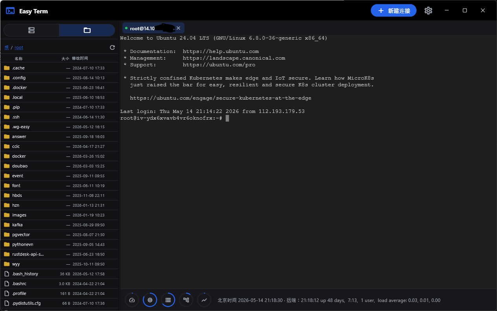
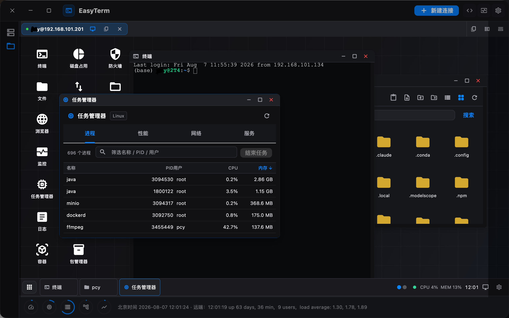

# EasyTerm

**EasyTerm** is a Flutter desktop SSH client: multi-tab terminals with split panes, an integrated SFTP file browser, an optional **remote visual desktop** (windows for terminal, files, browser, monitor, and more on the same SSH session), saved connections, an optional AI assistant (OpenAI-compatible Chat API) with guarded terminal actions, and a status bar / health board for remote metrics.

**EasyTerm** 是一款基于 Flutter 的桌面端 SSH 客户端：支持多标签终端与分屏、内置 SFTP 文件浏览（含远程文本编辑）、可选的 **远程可视化桌面**（同一 SSH 会话上以窗口打开终端、文件、浏览器、监控等）、已保存连接、可选的 AI 助手（OpenAI 兼容对话接口，终端操作建议需用户确认），以及状态栏 / 健康看板展示远端运行指标。

<p align="center">
  
  <br />
  <em>Terminal workbench / 终端工作台</em>
</p>

<p align="center">
  
  <br />
  <em>Remote visual desktop / 远程可视化桌面</em>
</p>

---

## English

### Highlights

- **SSH sessions in tabs** — Open several `user@host` sessions in one window; each tab owns its own connection and resources. Split panes (left/right/up/down) within a tab when you need side-by-side terminals.
- **Remote visual desktop** — Per-tab switch between classic terminal and a rendered desktop shell. Open multiple windows: terminal, file manager, internal browser (SSH gateway to remote localhost / LAN sites), host monitor (CPU/memory/disk/network, GPU via `nvidia-smi` when available), task manager, logs, Docker containers, disk-usage analyzer, transfer queue, and remote editor. Drag, resize, snap to edges, and remember preferred window sizes per host/app type.
- **Integrated SFTP file browser** — Browse remote paths with list or icon view; create/rename folders and files; copy, cut, and paste on the remote tree; upload files/folders; analyze disk usage; open a terminal at the current path; edit text with syntax highlighting and light syntax checks for common languages.
- **Flexible authentication** — Password, optional PEM private key (with passphrase when needed), plus handling for setups where keyboard-interactive is required.
- **Saved connections** — Store hosts, ports, users, optional device labels, and key paths; connect or edit from the sidebar.
- **AI assistant (optional)** — Right-side panel talks to an **OpenAI Chat Completions–compatible** endpoint (configurable base URL, model, and API key stored only on this machine). Streaming replies; optional **terminal tool** that proposes shell input—**each execution is confirmed in a dialog** before anything is sent to the PTY. Hidden while a tab is in desktop mode.
- **Workbench settings** — Grouped dialogs for **Terminal** (timeouts/retries, SSH keep-alive, PTY size and `TERM`, scrollback, font size and family, select-to-copy), **Interface** (English / 中文, light / dark / system theme, assistant panel width), and **LLM** (base URL, model, API key).
- **Status bar & health board** — Local and remote clock, plus remote snippets such as uptime and load; health board aggregates remote CPU, memory, disk, and load for connected hosts.

### Requirements

- [Flutter](https://docs.flutter.dev/get-started/install) SDK compatible with this project (`environment.sdk` in `pubspec.yaml`).
- **Windows** or **macOS** desktop tooling enabled in your Flutter installation (`flutter doctor`).

### Run from source

```bash
flutter pub get
flutter gen-l10n   # if localization outputs are not already generated
flutter run -d windows
# or
flutter run -d macos
```

Release builds follow the usual Flutter desktop flow, for example:

```bash
flutter build windows
flutter build macos
```

### Tech stack

| Area | Packages / notes |
|------|-------------------|
| SSH / SFTP | [`dartssh2`](https://pub.dev/packages/dartssh2) |
| Terminal UI | [`xterm`](https://pub.dev/packages/xterm) |
| Desktop window | [`window_manager`](https://pub.dev/packages/window_manager) |
| Embedded browser | [`flutter_inappwebview`](https://pub.dev/packages/flutter_inappwebview) (remote desktop browser app) |
| Settings | [`shared_preferences`](https://pub.dev/packages/shared_preferences) |
| Key file pick | [`file_picker`](https://pub.dev/packages/file_picker) |
| LLM HTTP | [`http`](https://pub.dev/packages/http) (OpenAI-compatible chat + streaming) |

This repo vendors a small [`desktop_drop`](https://pub.dev/packages/desktop_drop) override under `packages/desktop_drop` for reliable drag-and-drop on Windows (see `pubspec.yaml` `dependency_overrides`).

---

## 中文

### 功能概览

- **多标签 SSH** — 在同一窗口管理多个 `用户名@主机` 会话；每个标签独立连接与资源。支持分屏（左右上下）以便并排操作。
- **远程可视化桌面** — 每个标签可在「终端 / 桌面」间切换。桌面内可开多窗口：终端、文件管理器、内网浏览器（经 SSH 网关访问远端 localhost / 内网站点）、主机监控（CPU/内存/磁盘/网络，可用时通过 `nvidia-smi` 显示 GPU）、任务管理器、日志、Docker 容器、磁盘占用分析、传输队列与远程编辑器。支持拖动、缩放、贴边吸附，并按主机与应用类型记住窗口尺寸。
- **内置 SFTP 文件管理** — 列表 / 图标视图浏览远端目录；新建与重命名文件夹/文件；远端复制、剪切与粘贴；上传文件/文件夹；分析目录占用；在当前路径打开终端；编辑文本时支持语法高亮与常见语言的轻量语法检查。
- **多种登录方式** — 支持密码、可选 PEM 私钥（及密钥口令），并兼顾部分仅开启 keyboard-interactive 的服务端场景。
- **已保存连接** — 保存主机、端口、用户名、可选设备备注与私钥路径；在侧栏快速连接或编辑。
- **AI 助手（可选）** — 右侧助手面板通过 **OpenAI Chat Completions 兼容接口**对话（可配置基础地址、模型；**API Key 仅保存在本机**）。支持流式回复；可选 **终端工具** 由模型建议向当前 PTY 注入命令——**每次执行前均需用户在弹窗中确认**。标签处于桌面模式时助手面板隐藏。
- **工作台设置** — 分为 **终端**（连接超时与重试、SSH keep-alive、PTY 行列与终端类型、滚动缓冲、字号与字体、选中复制）、**界面**（**English / 中文**、浅色 / 深色 / 跟随系统、助手栏宽度等）与 **LLM**（基础 URL、模型、密钥）等对话框。
- **底部状态栏与健康看板** — 本地与远端时间；展示运行时间、负载等；健康看板汇总已连接主机的远端 CPU、内存、磁盘与负载。

### 环境要求

- 已安装与本项目 `pubspec.yaml` 中 `environment.sdk` 匹配的 [Flutter](https://docs.flutter.dev/get-started/install)。
- Flutter 已启用 **Windows** 或 **macOS** 桌面支持（可用 `flutter doctor` 自检）。

### 从源码运行

```bash
flutter pub get
flutter gen-l10n   # 若本地化代码尚未生成
flutter run -d windows
# 或
flutter run -d macos
```

发布构建可使用例如：

```bash
flutter build windows
flutter build macos
```

### 技术栈说明

| 模块 | 说明 |
|------|------|
| SSH / SFTP | [`dartssh2`](https://pub.dev/packages/dartssh2) |
| 终端界面 | [`xterm`](https://pub.dev/packages/xterm) |
| 桌面窗口 | [`window_manager`](https://pub.dev/packages/window_manager) |
| 内嵌浏览器 | [`flutter_inappwebview`](https://pub.dev/packages/flutter_inappwebview)（远程桌面浏览器应用） |
| 配置持久化 | [`shared_preferences`](https://pub.dev/packages/shared_preferences) |
| 私钥文件选择 | [`file_picker`](https://pub.dev/packages/file_picker) |
| 助手网络请求 | [`http`](https://pub.dev/packages/http)（兼容 OpenAI 的对话与流式响应） |

仓库在 `packages/desktop_drop` 中带有 `desktop_drop` 的本地覆盖，用于改善 Windows 下拖放行为（见根目录 `pubspec.yaml` 的 `dependency_overrides`）。

---

### Repository note

The Flutter package name in `pubspec.yaml` is `easyterm`; the product name shown in the app and localization files is **EasyTerm**. Built desktop binaries use the `easyterm` filename (e.g. `easyterm.app`, `easyterm.exe`).

Flutter 工程在 `pubspec.yaml` 里的包名为 `easyterm`，应用界面与文案中的产品名为 **EasyTerm**；桌面可执行文件名为 `easyterm`（如 `easyterm.app`、`easyterm.exe`）。
